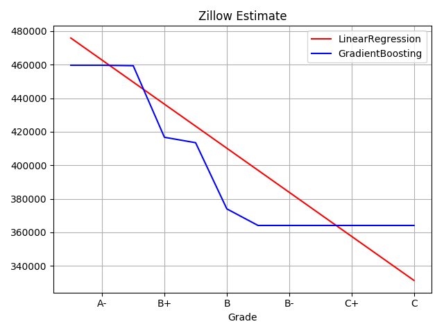
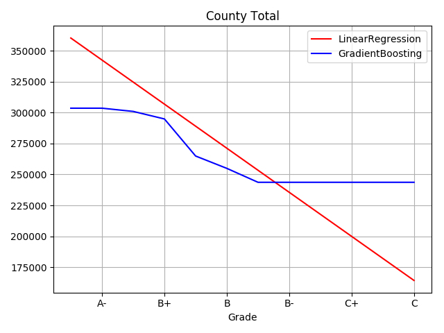
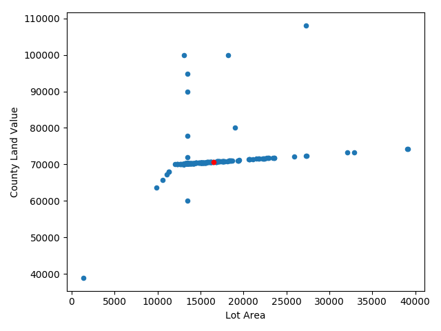
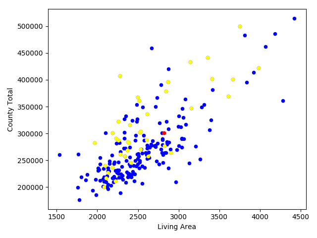
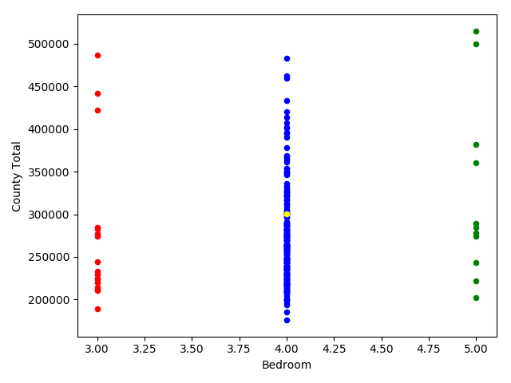
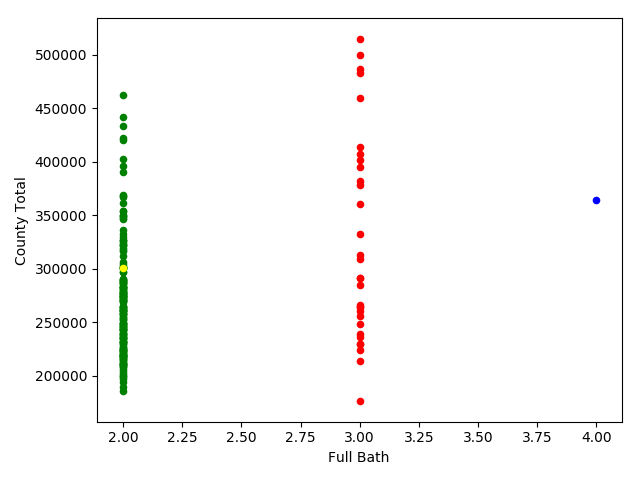
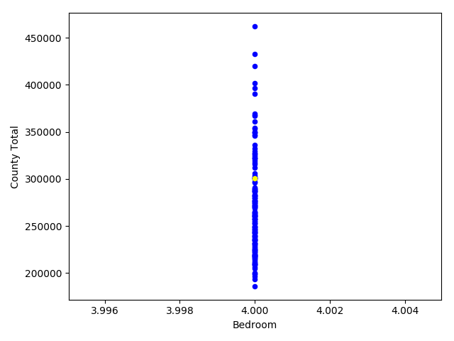

### Sample scripts to analyze the data
This subpackage contains some sample scripts to analyze the assessment data.  The following
dependencies are used:
- scipy/matplotlib
- pandas
- sklearn

#### [assessment/ml/comps.py](comps.py)

Compare values of comps and cost/sqft

```bash
python -m assessment.ml.comps --parcel 0000-K-00000-0000-00  --assessments assessments.csv

Assessment vs the assessments of its comps: 5007.186544342508
Area County $ Total/sqft: 108.18642113764068
Parcel assessment vs the assessments of its comps: 19025.0
Parcel County $ Total/sqft: 106.62885501595179
```
Example (from above):
- The average parcel value in assessments.csv is approx $5007 greater than its comps
- The average cost/sqft for assessments.csv is $108/sqft
- *Optionally* with --parcel:  compare a single parcel.  The example above is $19025 greater than its comps and $106/sqft

#### [assessment/ml/predict.py](predict.py)

Predict a home's value with respect to its grading

```bash
python -m assessment.ml.predict --parcel 0000-K-00000-0000-00  --assessments assessments.csv
```

1.  Zillow estimate of a home as grade changes



2.  Assessed value of a home as grade changes



#### [assessment/ml/plotdata.py](plotdata.py)
Various plots of the assessments

```bash
python -m assessment.ml.plotdata --parcel 0000-K-00000-0000-00  --assessments assessments.csv
```

1. Lot area vs Land Value



2. Living area vs assessed value



3. Assessed value vs number of bedrooms



4. Assessed value vs number of bathrooms



5. Assessed value vs number of bedrooms of the compared parcel



